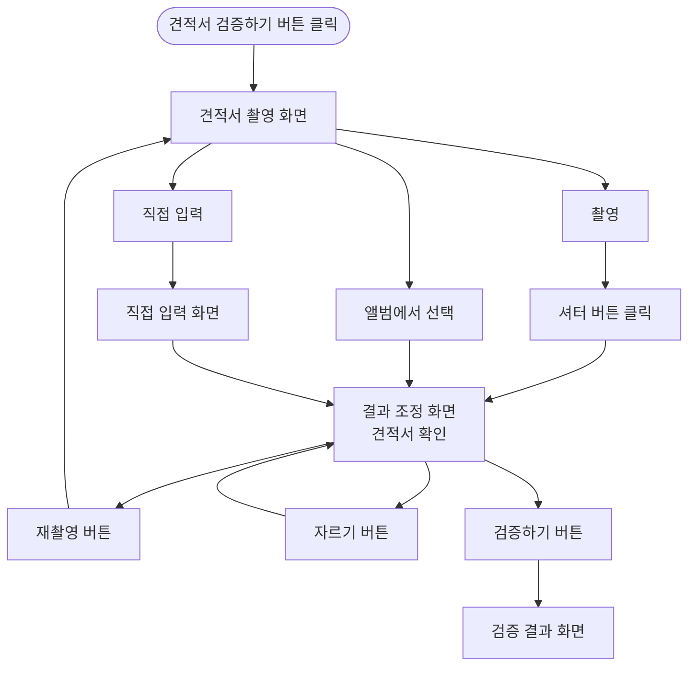

# 견적 데이터 입력 플로우차트

견적서 검증 서비스에서 **견적 데이터가 들어오는 경로**와 **결과 조정 → 검증 결과**까지의 흐름을 정리한 문서입니다.

---

## 1. 현재 플로우 요약 (완성 방향 제안 포함)

```
[견적서 검증하기 버튼 클릭]
         │
         ▼
┌─────────────────────┐
│ 견적서 촬영 화면     │
└─────────┬───────────┘
          │
    ┌─────┼─────┬─────────────┐
    ▼     ▼     ▼             │
 [촬영] [앨범] [직접입력]     │
    │     │     │             │
    ▼     │     ▼             │
[셔터 클릭] │  [직접 입력 화면]  │
    │     │     │ (항목·금액 입력)│
    │     │     │             │
    └─────┴─────┴──────┬──────┘
                      ▼
            ┌─────────────────────┐
            │ 결과 조정 화면       │  ← 견적서 확인(Review)
            │ (의뢰일·정비소·차량·  │
            │  VAT·정비 항목 수정) │
            └─────────┬───────────┘
                      │
        ┌─────────────┼─────────────┐
        ▼             ▼             ▼
   [재촬영]       [자르기]      [검증하기]
        │             │             │
        │             │             ▼
        └─────────────┴──→ [검증 결과 화면]
                                  │
                          (상세·공유·이력)
```

---

## 2. 완성할 때 넣으면 좋은 요소

### 2.1 직접 입력 경로 세분화

- **직접 입력** 선택 시 → **직접 입력 화면** 진입.
- 직접 입력 화면에서:
  - **차량번호로 불러오기** (선택) → 제조사·차종·연식·연료·주행거리 자동 채움.
  - 정비 항목·금액 수동 입력.
  - **[다음]** 또는 **[검증하기]** → **결과 조정 화면**으로 이동 (이미지 없이 텍스트만 있는 “확인” 화면으로 간주) 또는 바로 검증 결과로 가는 설계에 따라 한 단계 명시.

플로우차트에는 다음 중 하나로 표현하면 됩니다.

- `직접 입력 → 직접 입력 화면 → 결과 조정 화면(확인) → 검증하기 → 검증 결과`
- 또는 `직접 입력 → 직접 입력 화면 → 검증하기 → 검증 결과` (결과 조정 단계 생략 설계일 때)

### 2.2 결과 조정 화면(견적서 확인) 상세

- **라벨**: “결과 조정 화면” = 앱 내 **“견적서 확인”** 화면과 1:1로 매칭해 두면 이해하기 쉽습니다.
- **가능한 액션**:
  - 의뢰일자, 정비소, **차량**(차량번호 + 차량 정보 불러오기), 부가세, 정비 항목 수정.
  - **차량 정보 불러오기** → (API/목업) 조회 → 주행거리 입력/수정.
  - **재촬영** → 견적서 촬영 화면으로 복귀.
  - **자르기** → 크롭 UI 후 다시 결과 조정 화면.
  - **검증하기** → 검증 실행 → 검증 결과 화면.

차트에 “결과 조정 화면” 박스 옆에 괄호로 **(차량·항목 수정, 검증하기)** 정도만 적어도 흐름이 명확해집니다.

### 2.3 검증 결과 화면 이후(후속 플로우)

- 검증 결과 화면에서:
  - **항목별 상세** 보기.
  - **공유**.
  - **검증 이력 저장** (로그인 시 자동 또는 명시 저장).

플로우차트를 “입력 → 조정 → 검증 결과”에서 끝내지 말고, **검증 결과 화면 → (상세/공유/이력)** 을 짧게 한 단계 더 그려두면 서비스 전체 플로우와 맞습니다.

### 2.4 예외·에러 경로 (선택)

- **촬영 실패 / 카메라 권한 거부** → 안내 문구 + “다시 시도” → 견적서 촬영 화면 유지.
- **앨범 선택 취소** → 견적서 촬영 화면 유지.
- **결과 조정 화면에서 차량 정보 미입력 상태로 검증하기** → “차량 정보를 입력해 주세요” 안내 → 결과 조정 화면 유지.
- **검증(분석) 실패** → 에러 메시지 + 재시도/돌아가기.

간단한 버전은 “에러 시 해당 화면 유지 또는 촬영 화면으로 복귀” 한 줄로, 상세 버전은 다이어그램에 다이아몬드(조건)로 넣어도 됩니다.

---

## 3. 용어 매핑 (플로우차트 ↔ 앱)

| 플로우차트 용어   | 앱/코드 상 용어     | 비고 |
|------------------|---------------------|------|
| 견적서 촬영 화면 | `/verify/camera`    | 촬영·앨범·직접입력 진입점 |
| 결과 조정 화면   | 견적서 확인(Review) | `/verify/review` |
| 분석하기         | 검증하기            | 동일 버튼 |
| 분석 결과 화면   | 검증 결과 화면      | `/verify/result` |

---

## 4. Mermaid 예시 (복사해서 사용 가능)

Notion·GitHub·Markdown 뷰어에서 Mermaid를 지원하면 아래 코드로 플로우를 그릴 수 있습니다.



---

## 5. 완성 체크리스트

- [ ] **직접 입력** 경로: “직접 입력 화면” 한 단계 + 결과 조정(또는 검증)으로 가는 화살표 명시
- [ ] **결과 조정 화면**에 “차량 정보 불러오기·검증하기” 등 핵심 액션 표기
- [ ] **검증 결과 화면** 이후: 상세/공유/이력 중 필요한 것만 한 단계 추가
- [ ] **용어 통일**: 분석하기 = 검증하기, 분석 결과 = 검증 결과
- [ ] (선택) **예외 플로우**: 권한 거부, 차량 미입력, 검증 실패 등

이렇게 보완하면 “견적 데이터 입력” 관점의 플로우차트를 일관되게 완성할 수 있습니다.
