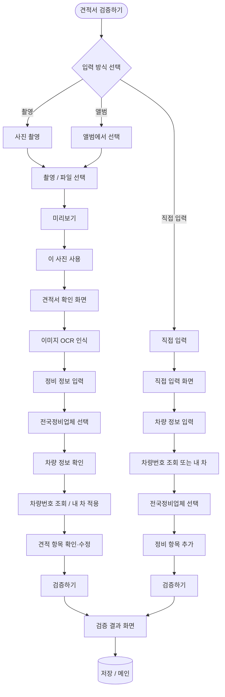

# 견적서 데이터 입력 플로우 (Mermaid)

플로우 기준: **사용자는 반드시 전국정비업체를 선택**합니다.  
입력 방식(촬영/앨범/직접입력)별로 차량 정보 → 전국정비업체 선택(필수) → 견적 항목이 반영된 전체 데이터 입력 플로우입니다.

## 플로우차트

## 데이터 입력 단계 요약

| 단계 | 이미지 경로 (촬영/앨범) | 직접 입력 경로 |
|------|-------------------------|----------------|
| 1 | 이미지 촬영 또는 선택 → OCR | — |
| 2 | **전국정비업체 선택** (필수) | **전국정비업체 선택** (필수) |
| 3 | 차량 정보 확인 (차량번호 조회 등) | 차량 정보 입력 (차량번호 조회 또는 내 차) |
| 4 | 견적 항목 확인·수정 | 정비 항목 추가 (이름, 부품비, 공임비) |
| 5 | 검증하기 → 결과 | 검증하기 → 결과 |
