# 서비스 유저 플로우 (Mermaid 다이어그램)

아래 다이어그램은 현재 앱의 모든 화면·전환을 담은 유저 플로우입니다.  
Mermaid 지원 환경(GitHub, Notion, VS Code 확장 등)에서 렌더링해 보시면 됩니다.

**이미지로 보기:** 각 섹션 아래에 PNG 이미지가 있습니다.  
전체 이미지 파일: [`docs/images/user-flow/`](./images/user-flow/)

---

## 1. 전체 화면 맵 (스크린 & 주요 링크)

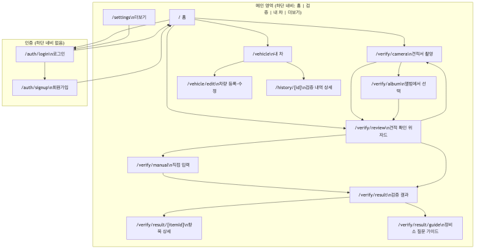

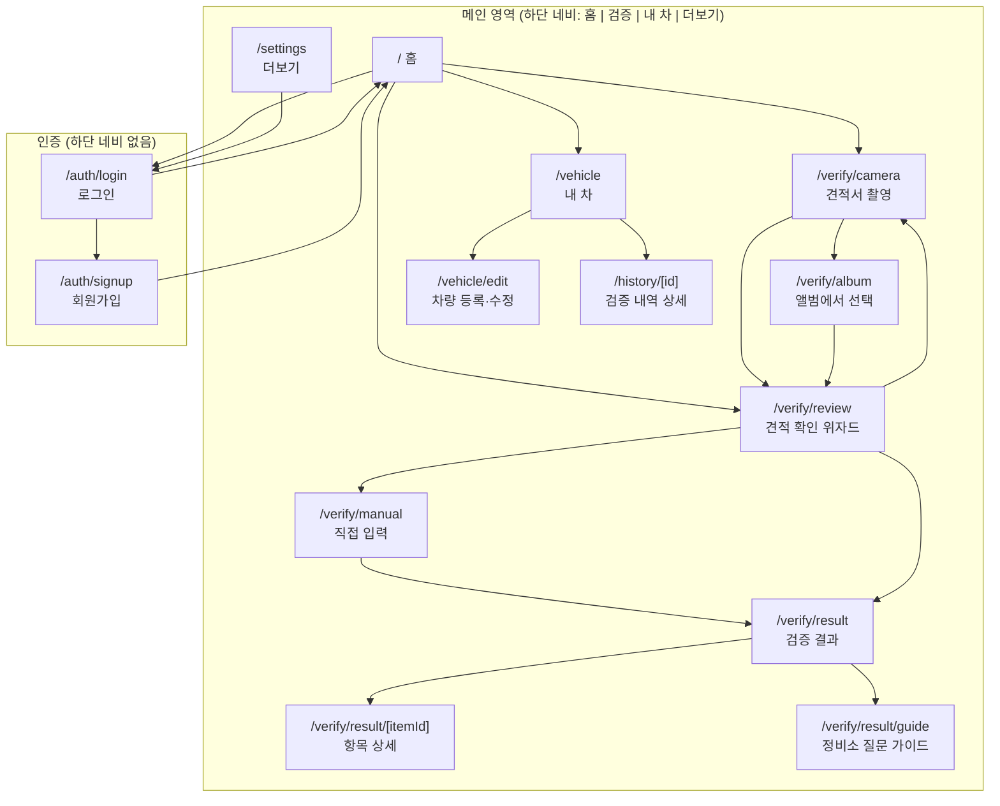

---

## 2. 진입 & 네비게이션

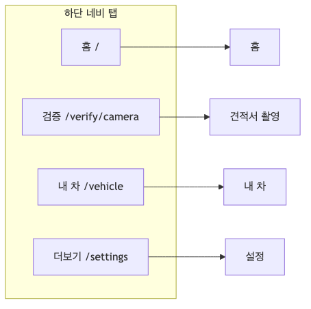

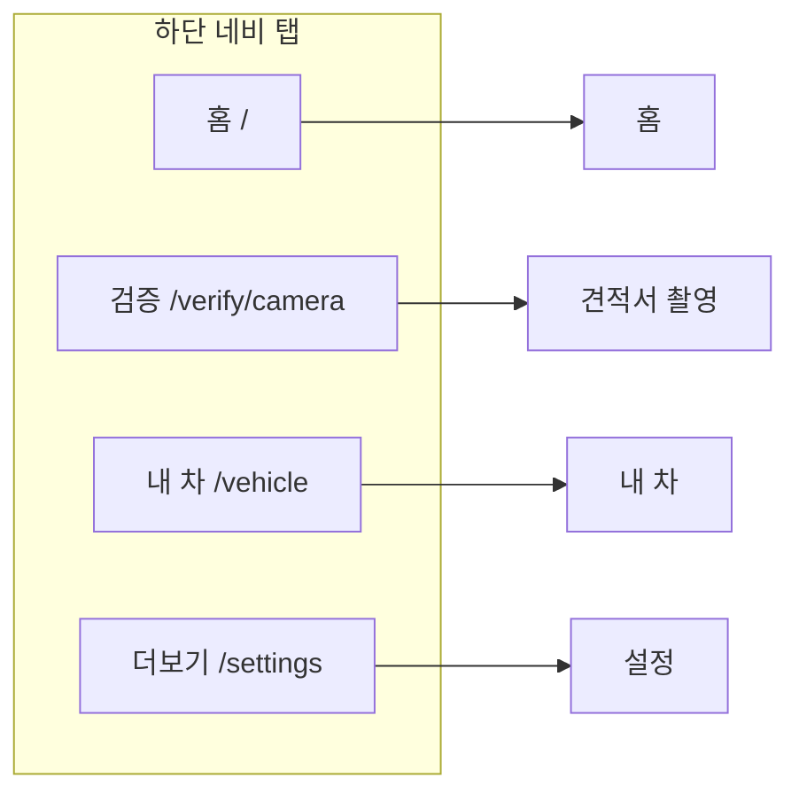

---

## 3. 인증 플로우 (Auth)

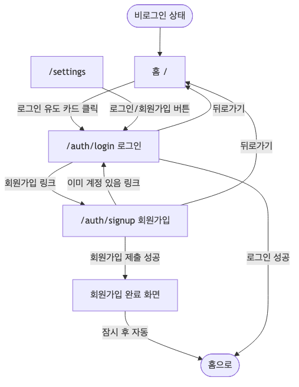

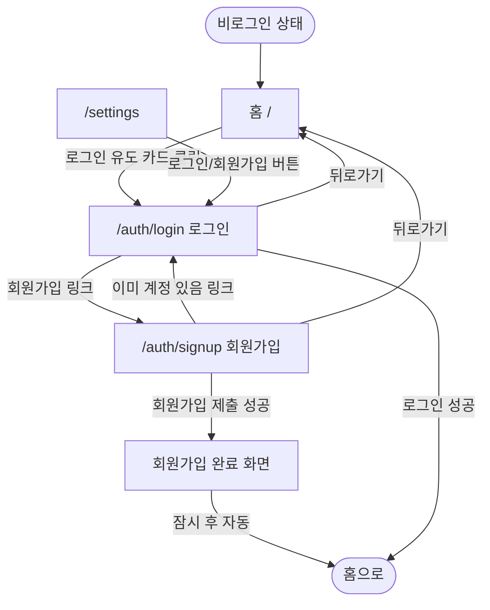

---

## 4. 검증 플로우 (Verify) — 전체

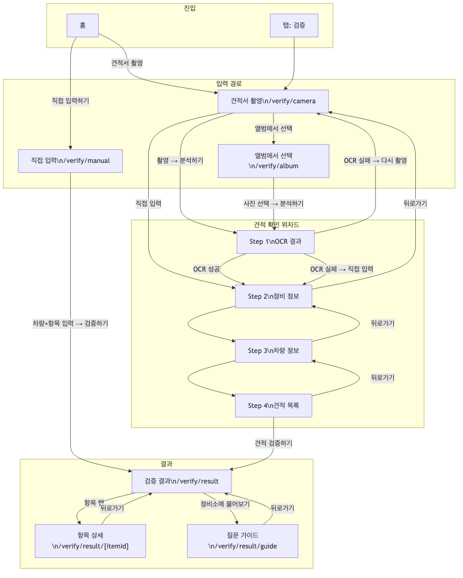

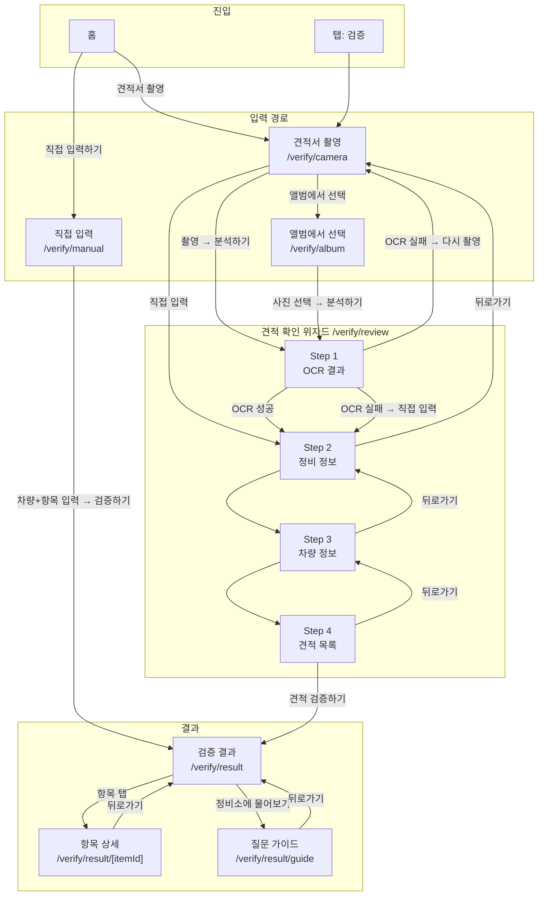

---

## 5. 검증 플로우 — 리뷰 위자드 상세 (Step 1~4)

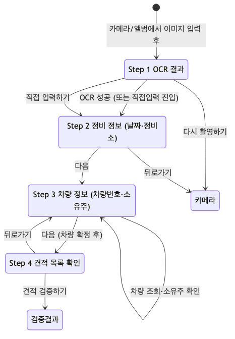

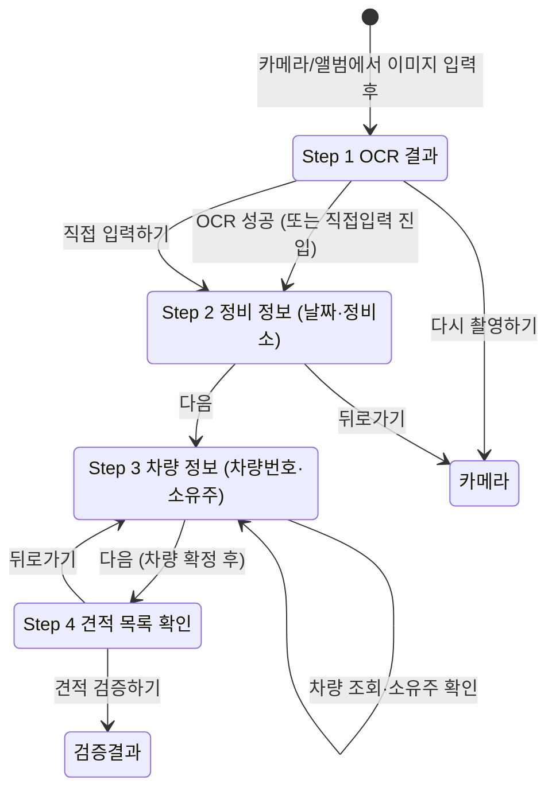

---

## 6. 촬영 화면 상태 (Camera)

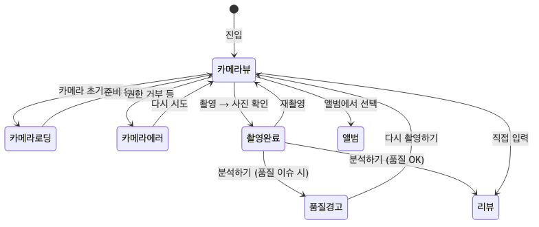

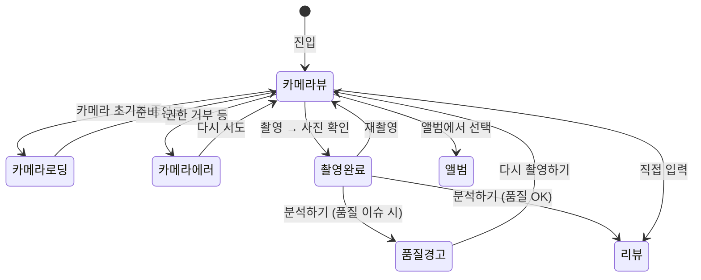

---

## 7. 내 차 & 검증 내역

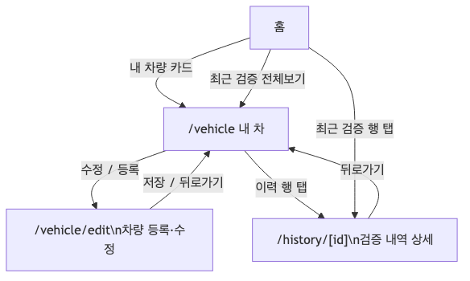

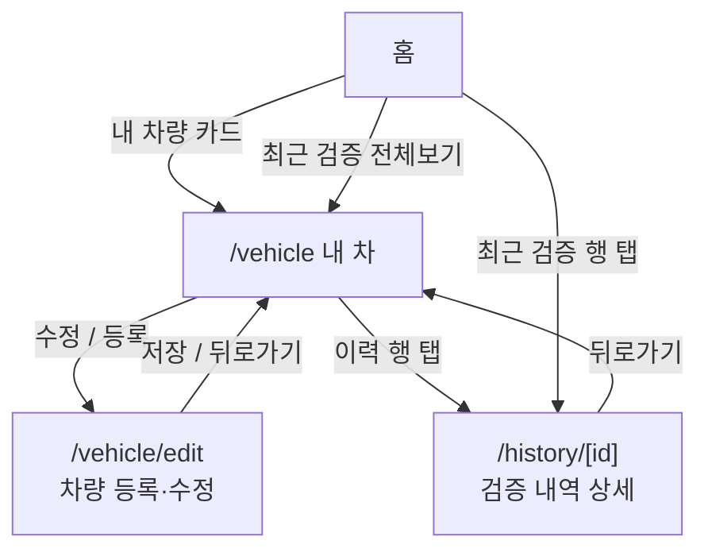

---

## 8. 설정(더보기) 플로우

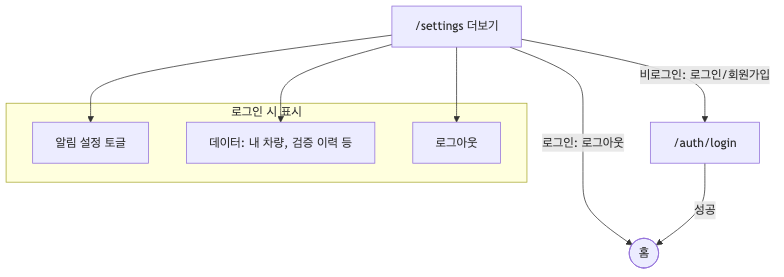

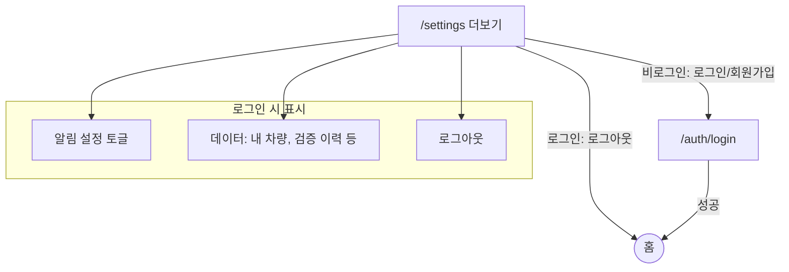

---

## 9. 한 장 요약 (심플 플로우)

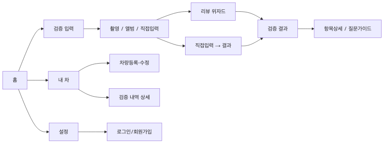

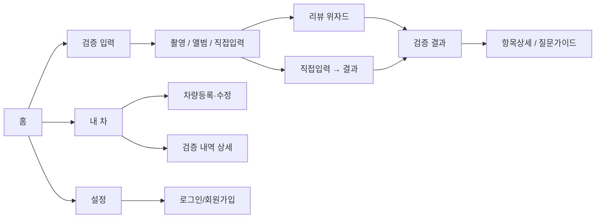

---

## 10. 조건 분기 (로그인 여부)

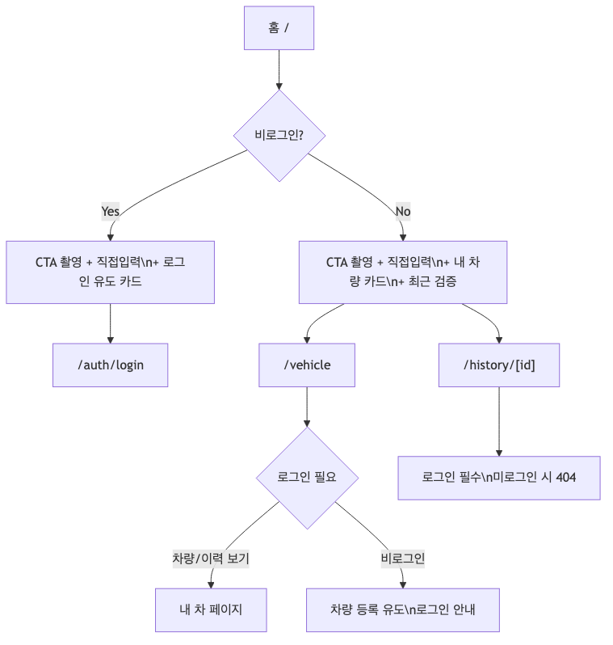

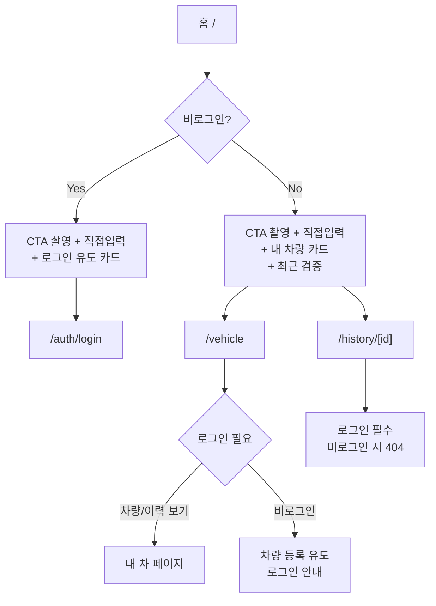

---

- **라우트 정리**
  - 메인: `/`, `/verify/camera`, `/verify/album`, `/verify/manual`, `/verify/review`, `/verify/result`, `/verify/result/[itemId]`, `/verify/result/guide`, `/vehicle`, `/vehicle/edit`, `/history/[id]`, `/settings`
  - 인증: `/auth/login`, `/auth/signup`
- **직접 입력**: 홈 또는 촬영 화면에서 “직접 입력” 시 `directInput` 플래그로 `/verify/review`가 Step 2(정비 정보)부터 시작.
- **검증 내역 상세**: 로그인한 사용자만 `/history/[id]` 접근 가능, 그 외 404.
