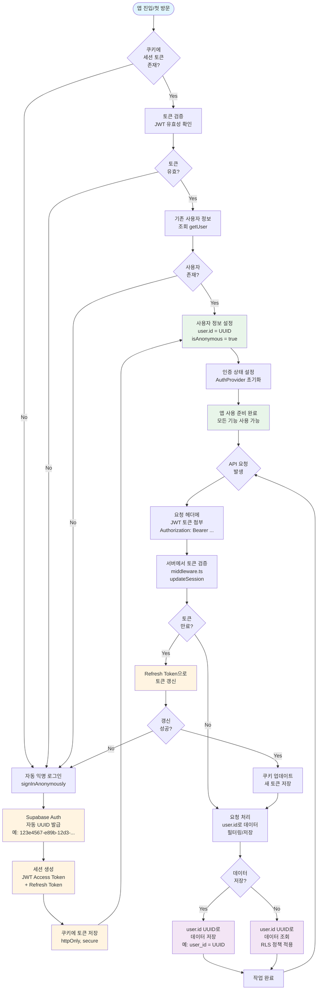

# 유저 식별 플로우차트

## 개요
- **배포 형태**: 웹앱 → 네이티브 앱 (예정)
- **인증 방식**: 로그인/로그아웃 없이 자동 UUID 발급 + 토큰 인증
- **유저 관리**: Supabase Auth의 익명 인증 + JWT 토큰 기반 세션 관리

## 플로우차트



## 상세 설명

### 1. 앱 진입 시 (첫 방문)

```
1. 앱 실행/웹 접속
2. 쿠키 확인 (세션 토큰 존재 여부)
   ├─ 있음 → 토큰 검증
   └─ 없음 → 자동 익명 로그인
```

### 2. 자동 UUID 발급

```
1. Supabase Auth의 signInAnonymously() 호출
2. Supabase가 자동으로 UUID 생성
   - 형식: UUID v4 (예: 123e4567-e89b-12d3-a456-426614174000)
   - 저장 위치: Supabase Auth 테이블
   - 플래그: is_anonymous = true
3. JWT 토큰 생성
   - Access Token (짧은 수명, API 인증용)
   - Refresh Token (긴 수명, 토큰 갱신용)
```

### 3. 토큰 저장 및 관리

```
1. 쿠키에 토큰 저장
   - 이름: sb-<project-ref>-auth-token
   - 속성: httpOnly, secure, sameSite
   - 만료: Refresh Token 기준
2. 클라이언트 상태 관리
   - AuthProvider에서 user 객체 보관
   - user.id = UUID
   - user.is_anonymous = true
```

### 4. API 요청 시 토큰 사용

```
1. 모든 API 요청에 자동으로 토큰 첨부
   - Supabase 클라이언트가 자동 처리
   - Authorization 헤더에 Bearer 토큰 포함
2. 서버에서 토큰 검증
   - middleware.ts의 updateSession() 실행
   - JWT 유효성 확인
   - 만료 시 자동 갱신
```

### 5. 데이터 저장/조회

```
1. 데이터 저장 시
   - user_id 컬럼에 user.id (UUID) 저장
   - 예: INSERT INTO estimates (user_id, ...) VALUES (user.id, ...)
2. 데이터 조회 시
   - RLS 정책으로 user.id로 필터링
   - 예: SELECT * FROM estimates WHERE user_id = auth.uid()
```

### 6. 토큰 갱신

```
1. Access Token 만료 감지
2. Refresh Token으로 새 Access Token 발급
3. 쿠키 업데이트
4. 요청 계속 처리
```

## 주요 특징

### ✅ 자동화
- 사용자 개입 없이 UUID 발급
- 토큰 관리 자동화
- 세션 갱신 자동화

### ✅ 보안
- JWT 토큰 기반 인증
- httpOnly 쿠키로 XSS 방지
- RLS 정책으로 데이터 격리

### ✅ 사용자 경험
- 로그인/로그아웃 불필요
- 즉시 사용 가능
- 앱 재실행 시에도 세션 유지

### ✅ 확장성
- 익명 사용자 → 로그인 사용자 전환 가능
- UUID는 변경되지 않음
- 데이터 연속성 보장

## 기술 스택

- **인증**: Supabase Auth (익명 인증)
- **토큰**: JWT (Access Token + Refresh Token)
- **세션 관리**: @supabase/ssr (쿠키 기반)
- **미들웨어**: Next.js middleware.ts
- **상태 관리**: React Context (AuthProvider)

## 향후 개선 사항 (앱 배포 시)

1. **디바이스별 UUID 관리**
   - 디바이스 ID와 UUID 매핑
   - 디바이스 변경 시 처리

2. **오프라인 지원**
   - 로컬에 UUID 저장
   - 오프라인 데이터 동기화

3. **푸시 알림 연동**
   - UUID로 디바이스 토큰 매핑
   - 개인화된 알림 전송
